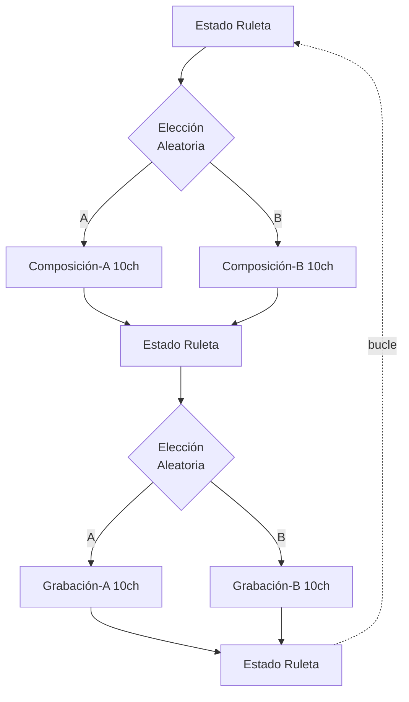

# Documentación Nodo Audio

El nodo de Audio está programado en max-msp (Max8).
La aplicación escucha los mensajes OSC enviados por el nodo principal y reaccionaa ellos determinísticamente cambiando al estado sonoro correspondiente.

Diagrama de flujo general
---

